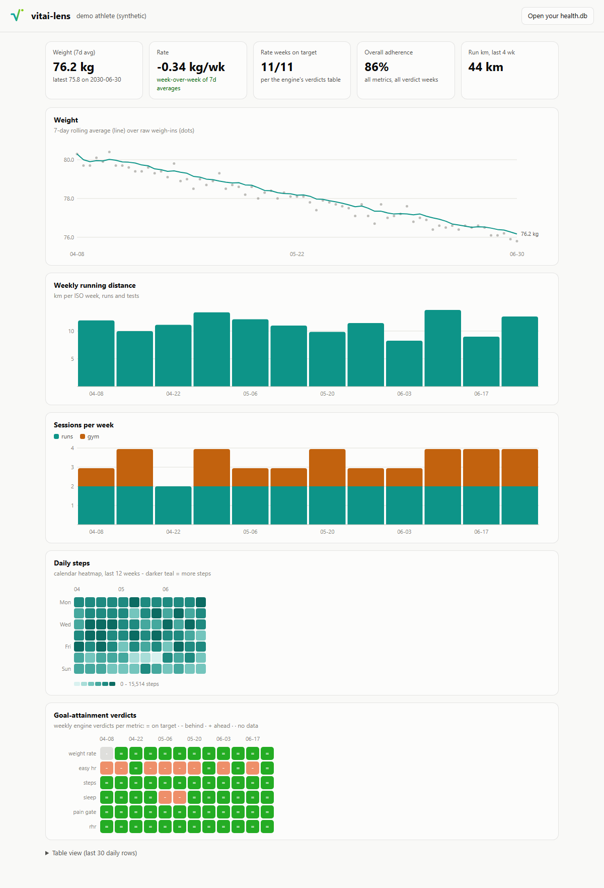

# vitai-lens

**The stats deck for [vitai](https://github.com/Wombat164/vitai).** A
local-first dashboard that reads a vitai read model (`derived/health.db`)
and shows the athlete their numbers: trends, weekly loads, calendar
heatmaps, and the engine's goal-attainment verdicts. Built for two
audiences at once: outcome-optimizers (verdict first) and stats-junkies
(everything else).



## Run it

```bash
git clone https://github.com/Wombat164/vitai-lens.git
cd vitai-lens
python -m http.server 8765     # any static server works
# open http://localhost:8765 - loads the synthetic demo athlete
```

Then click **Open your health.db** and pick the `derived/health.db` from
your own vitai content repo. Everything runs in your browser via
sql.js/WebAssembly - **no server-side anything, your data never leaves the
machine**.

That claim now covers the code as well as the data. sql.js is vendored in
`vendor/`, not fetched: the parser used to arrive from a CDN on every load
with no integrity attribute, which made the page useless offline and put a
third party inside the trust boundary - a substituted parser would have had
the database in the same JS heap it had just built. `tools/test_offline.py`
aborts every request that leaves the origin and fails if the page still
wants one, so a regression to a remote reference is caught rather than
discovered by someone on a train.

## What it shows (v0.1)

- **The brief**: the record turned into English, by a template engine and
  not a language model. It opens with the plan and the arc through it -
  what you said you wanted, and every edit you made to it with the reason
  you gave at the time. Every sentence carries a control that runs the
  query it came from, so you can disagree with it. See
  [docs/prior-art.md](docs/prior-art.md) for the lineage this borrows from
  and why a small model was rejected rather than merely not attempted.
- **Ask it something**: type a question in your own words and get an answer
  in prose, with the query it came from. It is a natural-language interface
  to a fixed schema, not a language model, and the interesting half is what
  it refuses: judgments ("is this a good plan"), predictions ("what will
  they weigh next month") and causes ("why are they tired") are declined by
  name, because a record reader is not entitled to any of the three
- **Where two sources disagreed**: every comparison the engine made, what it
  kept and what it discarded, and whether the two sources were independent -
  because a value that reached the record twice by one path corroborates the
  copying and not the measurement
- Narrative about a **measurement** sits under the chart that shows it, not
  in the brief: the sentence about unlogged days is under the heatmap where
  the unlogged days are drawn. What is left at the bottom is record-wide
  and belongs to no single chart.
- Weight: every weigh-in the record holds, positioned by date, with gaps
  drawn as gaps
- Weekly running distance and sessions per week
- Daily-steps calendar heatmap
- The engine's weekly **goal-attainment verdicts** per metric, including
  refusals with the reason the engine gave, and empty cells where it
  emitted no row at all
- A table view for accessibility and copy-paste

Light and dark mode follow the system; the chart palette is validated for
color-vision deficiency and surface contrast in both modes.

## The one rule

**The lens may not compute.** Every number on screen came out of a table.
No averages, no rates, no totals, no percentages, no re-bucketing.

If the lens cannot render something without deriving it, that is an issue
against vitai, not code here. The lens's blank spaces are the roadmap, and
they belong to the engine. See [RULES.md](RULES.md) for why.

This is what makes the repo worth having. A client that computes is
answering its own question and proves nothing about the engine - and it
hides engine gaps, because a number the engine will not stand behind
appears anyway, slightly differently in every consumer.

## Relationship to vitai

vitai-lens is deliberately a SEPARATE repo: it is the reference consumer of
vitai's platform contract (the `health.db` tables + `verdicts` +
`meta.contract`), which keeps the engine honest - if the lens needs a
schema change, so would any game or third-party dashboard, and that
conversation happens in the contract, not in private coupling. The lens
never writes: the record and its derivations belong to the engine.

That framing has already paid for itself. The first audit of this repo
found that the lens had quietly become a second engine - four of four stat
tiles and three of five charts were computed here - and the fix produced
four new rules and a contract the engine now emits. The lens found them by
falling into them, which is the cheapest way to find anything.

`meta.contract` compatibility: built against contract `25`, and the page
**refuses to render** on a mismatch. Most queries would still resolve
against a newer contract, so the page would look complete while silently
dropping whatever that contract added. A client that will not start is a
bug report; a client that renders sixty per cent of the truth is a lie with
a chart on it.

## Roadmap

Not a feature list. Two lists, and the split is the point.

**Ours** - the data is already in the database and the lens simply does not
read it:

- [#1](https://github.com/Wombat164/vitai-lens/issues/1) **Provenance on
  screen.** A modelled value and a measured one are currently the same ink.
  The largest open gap here, and the one thing not blocked on anyone else.
- [#2](https://github.com/Wombat164/vitai-lens/issues/2) The `resolution`
  table records source disagreements the athlete never sees.
- [#3](https://github.com/Wombat164/vitai-lens/issues/3) Vendor sql.js - the
  page does not work offline and the parser comes from a CDN unpinned.

**Theirs** - found by this client hitting a wall, which is what it is for:

- **CLOSED** [vitai#207](https://github.com/Wombat164/vitai/issues/207) The
  built database is not a function of the record alone: `goal_progress`
  followed the wall clock and the viewpoint was not recorded. It shipped
  empty. Fixed at contract 23 - an unqualified build now takes its viewpoint
  from the record's own last date, and `meta` records it.
- **CLOSED** [vitai#208](https://github.com/Wombat164/vitai/issues/208) No
  weekly rollup of sessions or distance, so every client computed the most
  ordinary chart in the genre - and this one got it wrong twice before anyone
  noticed. Fixed at contract 28: `session_weeks` holds sessions, distance and
  duration per week per type, and the lens now answers *how many km a week do
  I run* by reading it. **This is the loop working end to end** - the lens hit
  the wall, the wall became an issue, the engine emitted the table, and the
  refusal became an answer without a line of arithmetic moving into this repo.
- [vitai#209](https://github.com/Wombat164/vitai/issues/209) What may a client
  show as a headline figure without inventing it? The four tiles this repo
  had to delete. **Still open.**

A third list, deliberately empty: things the lens works around. There are
none, and there should never be any.

## Demo data

`demo/health.db` is generated through the real vitai engine from a seeded
synthetic athlete (`tools/make_demo.py`). No real person's data is in this
repository, ever.

## License

MIT.
